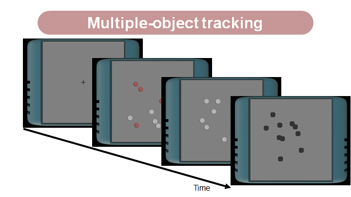
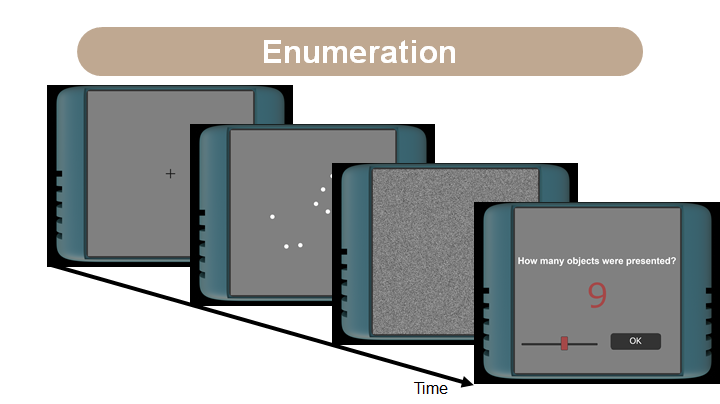
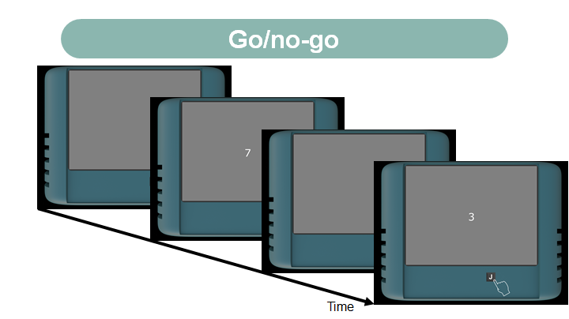
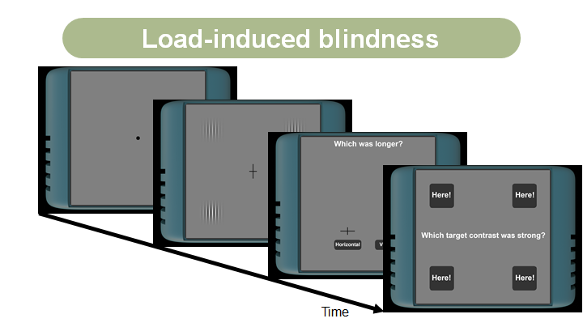
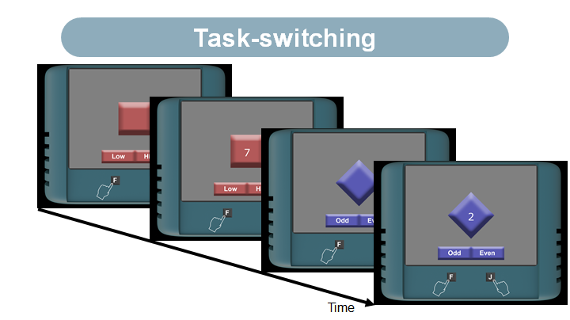
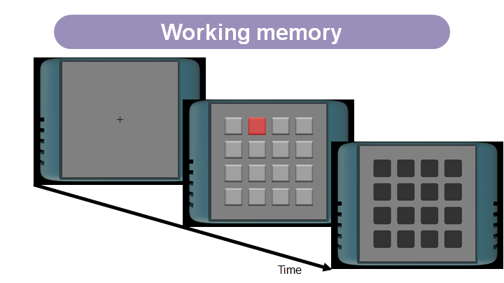
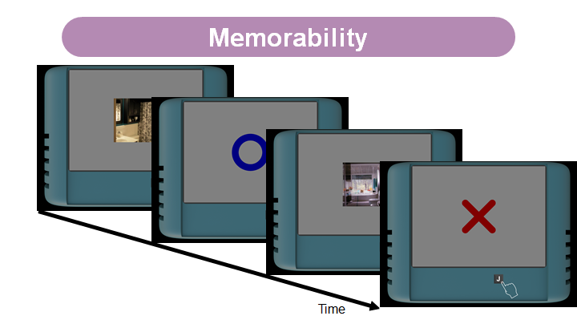

# An open-source cognitive test battery to assess human attention and memory
This repository includes the source code and playground for the research project: An open-source cognitive test battery to assess human attention and memory.
by M. Adolphe, M. Sawayama, D. Maurel, A. Delmas, P. Y. Oudeyer, & H. Sauzeon (2022). 

Link to paper: https://www.frontiersin.org/articles/10.3389/fpsyg.2022.880375/full


We implemented our test battery using a javascript library, p5.js (https://p5js.org/). 

## Abstract

Cognitive test batteries are widely used in diverse research fields, such as cognitive training, cognitive disorder assessment, or brain mechanism understanding. Although they need flexibility according to the objectives of their usage, most of the test batteries are not be available as open-source software and not be tuned by researchers in detail. The present study introduces an open-source cognitive test battery to assess attention and memory, using a javascript library, p5.js. Because of the ubiquitous nature of dynamic attention in our daily lives, it is crucial to have tools for its assessment or training. For that purpose, our test battery includes seven cognitive tasks (multiple-objects tracking, enumeration, go/no-go, load-induced blindness, task-switching, working memory, and memorability), common in cognitive science literature. By using the test battery, we conducted an online experiment to collect the benchmark data. Results conducted on two separate days showed the high cross-day reliability. Specifically, the task performance did not largely change with the different days. Besides, our test battery captures diverse individual differences and can evaluate them based on the cognitive factors extracted from latent factor analysis. Since we share our source code as open-source software, users can expand and manipulate experimental conditions flexibly. Our test battery is also flexible in terms of the experimental environment, i.e., it is possible to experiment either online or in a laboratory environment.


## Playground

We prepare playgrounds to test our cognitive tasks to support users' understanding of the task procedure. 
For our seven tasks, users can play how they work. We do not save any participants' performances in these playgrounds. 
We calibrate our playgrounds for a monitor of 15.4 inches and 
suppose that a participant observes it from a distance of 50cm.  


### multiple object tracking task [[start to play]](https://mswym.com/cog_test/include/main_moteval_task.html)



### enumeration task [[start to play]](https://mswym.com/cog_test/include/main_enumeration_task.html)



### go/no-go task [[start to play]](https://mswym.com/cog_test/include/main_gonogo_task.html)



### load-induced blindness task [[start to play]](https://mswym.com/cog_test/include/main_loadblindness_task.html)



### task-switching task [[start to play]](https://mswym.com/cog_test/include/main_taskswitch_task.html)



### working memory task [[start to play]](https://mswym.com/cog_test/include/main_workingmemory_task.html)



### memorability task [[start to play]](https://mswym.com/cog_test/include/main_memorability_task1.html)



## Run the test battery on users' local machine

Our cognitive test battery includes a memorability task and depends on the image dataset, 
FIne-GRained Image Memorability (FIGRIM) Dataset, used in the previous works 
(Bylinskii, Isola, Bainbridge, Torralba, and Oliva, 2015). These works annotated
the images with participants' memorability performance, and we decided the images 
for our test battery according to the standard performance. Download the images,
`Targets` and `Fillers`, from the following link (http://figrim.mit.edu/). 
Then, put these directories under the directory `img` in our repository. 
We used some images in the categories of `bedroom`, `living_room
`, and `kitchen`. 

Once users clone our repository and put the FIGRIM dataset on the directory, 
users can start our test battery just by running index.html using a local server. 
If users are not familiar with the setting of a local server, 
`Live Server` on `Visual Studio Code` may be easy to start. 

According to the user's local machine environment, 
they can change the monitor setting using config.js files in each task directory
`/js/app_name-of-task/`. By default, the monitor parameter is tuned to a 15.4 inches monitor, 
but they can change the parameter `size_screen_cm_w` according to the monitor's width in cm. 

## Run the test battery on a shared server (e.g., Pavlovia)

We will update the instruction about how to launch our test battery on a shared server like Pavlovia (https://pavlovia.org/) (in preparation).

## Run the test battery on a user's server with Django platform

In our experiment shown in the paper, we used a python web framework, Django 
(https://www.djangoproject.com/), to organize informed consent, participant's basic questionary,
and monitor size questionary. The source code is available from 
https://github.com/madolphe/Flowers-OL/tree/master/flowers-ol. We will also guide how to connect our test battery with 
the web framework. (In preparation)

## Citation
```
@article{adolphe2022opensource,
  title={An open-source cognitive test battery to assess human attention and memory},
  author={Adolphe, Maxime and Sawayama, Masataka and Maurel, Denis and Delmas, Alexandra and Oudeyer, Pierre-Yves and Sauzeon, Helene},
  journal={Frontiers in Psychology},
  volume={13},
  pages={1--16},
  year={2022},
}
```
